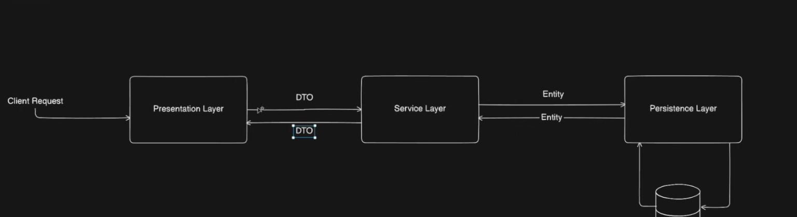
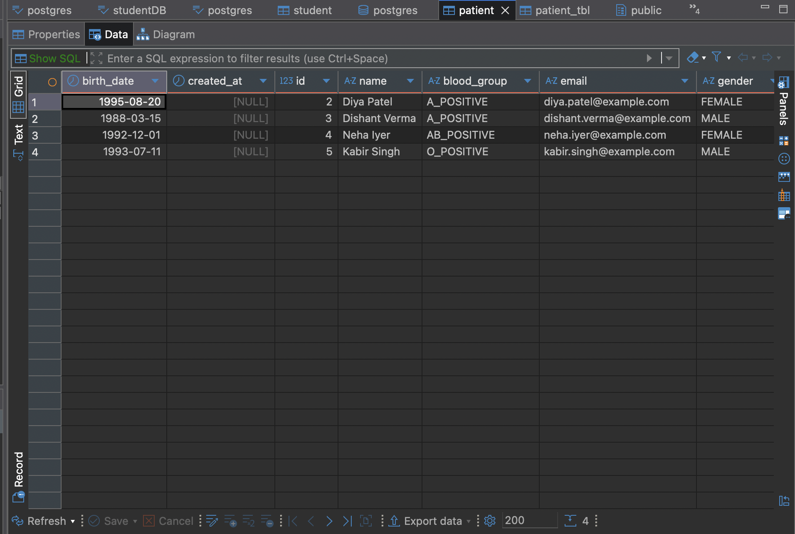

# Hospital Management System (Spring Boot + JPA)

A backend system for managing hospital operations, built with Spring Boot and Spring Data JPA. This project currently supports patient records management and is designed with a clean, layered architecture.

## Architecture Flow



## Database Schema



## Features
- Patient entity with name, gender, birth date, email, and blood group
- Unique constraints and validation for patient data
- Initial patient data loaded via SQL script
- PostgreSQL database integration
- Service and repository layers for business logic and data access
- Ready for extension (doctors, appointments, medical history, etc.)

## Technologies Used
- Java 21
- Spring Boot 3.5.x
- Spring Data JPA (Hibernate)
- PostgreSQL
- Maven
- Lombok

## Getting Started

### Prerequisites
- Java 21+
- Maven
- PostgreSQL

### Database Setup
1. Create a PostgreSQL database (e.g., `hospital_db`).
2. Update `src/main/resources/application.properties` with your database credentials:
   ```properties
   spring.datasource.url=jdbc:postgresql://localhost:5432/hospital_db
   spring.datasource.username=your_db_user
   spring.datasource.password=your_db_password
   ```

### Running the Application
```bash
./mvnw spring-boot:run
```
The application will start on [http://localhost:8069](http://localhost:8069) by default.

### Initial Data
- The `data.sql` file will insert sample patient records into the database on startup.

## Project Structure
```
src/main/java/com/mohit/hospitalManagement/
├── entity/           # JPA entities (Patient, BloodGroupType)
├── repository/       # Spring Data JPA repositories
├── service/          # Service layer
├── HospitalManagementApplication.java  # Main entry point
```

## Extending the Project
- Add new entities (Doctor, Appointment, etc.) in the `entity/` package
- Create corresponding repositories and services
- Add REST controllers for API endpoints

## License
This project is licensed under the MIT License.

---
Feel free to contribute or open issues for suggestions and improvements!
